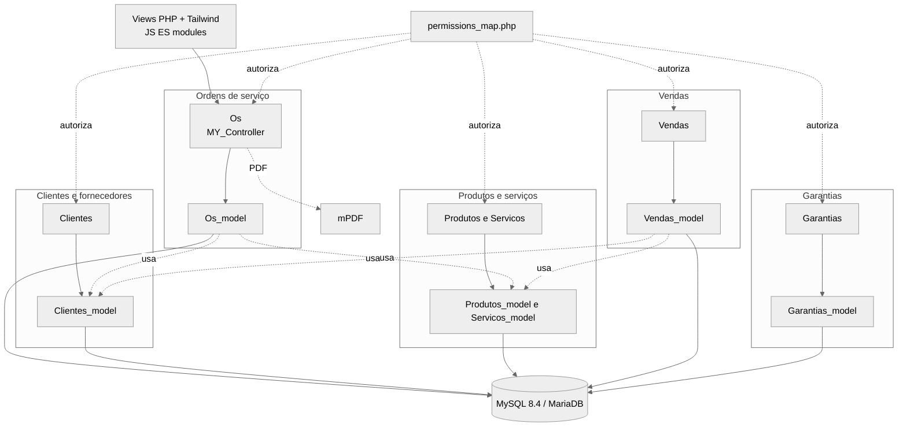

## Arquitetura Interna — Gestão do negócio

Layers internos e integrações da área Gestão do negócio.

---

```mermaid
%%{init: {'theme': 'neutral'} }%%
flowchart TD
  V["Views PHP + Tailwind\nJS ES modules"] --> C
  subgraph Os[Ordens de serviço]
    C["Os\nMY_Controller"] --> M["Os_model"]
  end
  subgraph Cli[Clientes e fornecedores]
    C2["Clientes"] --> M2["Clientes_model"]
  end
  subgraph Cat[Produtos e serviços]
    C3["Produtos e Servicos"] --> M3["Produtos_model e Servicos_model"]
  end
  subgraph Ven[Vendas]
    C4["Vendas"] --> M4["Vendas_model"]
  end
  subgraph Gar[Garantias]
    C5["Garantias"] --> M5["Garantias_model"]
  end
  Perm["permissions_map.php"] -.->|autoriza| C
  Perm -.->|autoriza| C2
  Perm -.->|autoriza| C3
  Perm -.->|autoriza| C4
  Perm -.->|autoriza| C5
  M -.->|usa| M2
  M -.->|usa| M3
  M4 -.->|usa| M2
  M4 -.->|usa| M3
  M & M2 & M3 & M4 & M5 --> DB[("MySQL 8.4 / MariaDB")]
  C -.->|PDF| Pdf["mPDF"]
```

---

_Criado em: 
