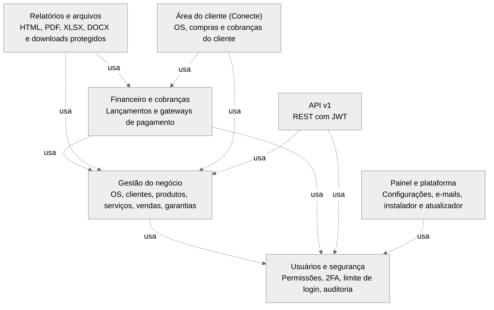

## Arquitetura Interna

Organização em módulos e camadas do código-fonte.

---

```mermaid
%%{init: {'theme': 'neutral'} }%%
flowchart TB
  Gestao["Gestão do negócio\nOS, clientes, produtos, serviços, vendas, garantias"]
  Fin["Financeiro e cobranças\nLançamentos e gateways de pagamento"]
  Rel["Relatórios e arquivos\nHTML, PDF, XLSX, DOCX e downloads protegidos"]
  Acesso["Usuários e segurança\nPermissões, 2FA, limite de login, auditoria"]
  Conecte["Área do cliente (Conecte)\nOS, compras e cobranças do cliente"]
  Api["API v1\nREST com JWT"]
  Plat["Painel e plataforma\nConfigurações, e-mails, instalador e atualizador"]
  Fin -.->|usa| Gestao
  Rel -.->|usa| Gestao
  Rel -.->|usa| Fin
  Conecte -.->|usa| Gestao
  Conecte -.->|usa| Fin
  Api -.->|usa| Gestao
  Gestao -.->|usa| Acesso
  Fin -.->|usa| Acesso
  Api -.->|usa| Acesso
  Plat -.->|usa| Acesso
```

---

_Criado em: 
