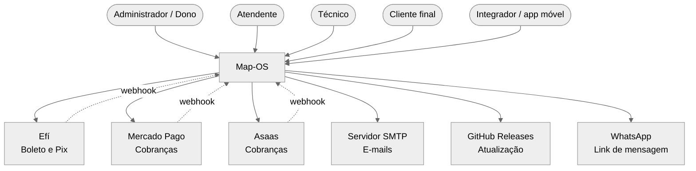

## Contexto

Visão externa: atores, integrações e dependências.

---

```mermaid
%%{init: {'theme': 'neutral'} }%%
flowchart TD
  Dono([Administrador / Dono]) --> S[Map-OS]
  Atend([Atendente]) --> S
  Tec([Técnico]) --> S
  Cli([Cliente final]) --> S
  Int([Integrador / app móvel]) --> S
  S --> Efi["Efí\nBoleto e Pix"]
  S --> MP["Mercado Pago\nCobranças"]
  S --> Asaas["Asaas\nCobranças"]
  S --> SMTP["Servidor SMTP\nE-mails"]
  S --> GH["GitHub Releases\nAtualização"]
  S --> Whats["WhatsApp\nLink de mensagem"]
  Efi -.->|webhook| S
  MP -.->|webhook| S
  Asaas -.->|webhook| S
```

---

_Criado em: 
