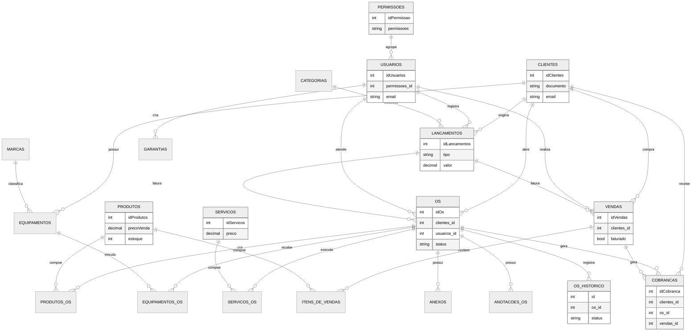

## Modelo de Dados

Entidades, campos-chave e relações.

---

```mermaid
%%{init: {'theme': 'neutral'} }%%
erDiagram
  PERMISSOES ||--o{ USUARIOS : agrupa
  CLIENTES ||--o{ OS : abre
  USUARIOS ||--o{ OS : atende
  LANCAMENTOS ||--o{ OS : fatura
  OS ||--o{ PRODUTOS_OS : usa
  OS ||--o{ SERVICOS_OS : executa
  OS ||--o{ EQUIPAMENTOS_OS : recebe
  OS ||--o{ ANEXOS : possui
  OS ||--o{ ANOTACOES_OS : possui
  OS ||--o{ OS_HISTORICO : registra
  PRODUTOS ||--o{ PRODUTOS_OS : compoe
  SERVICOS ||--o{ SERVICOS_OS : compoe
  CLIENTES ||--o{ EQUIPAMENTOS : possui
  MARCAS ||--o{ EQUIPAMENTOS : classifica
  EQUIPAMENTOS ||--o{ EQUIPAMENTOS_OS : vincula
  CLIENTES ||--o{ VENDAS : compra
  USUARIOS ||--o{ VENDAS : realiza
  LANCAMENTOS ||--o{ VENDAS : fatura
  VENDAS ||--o{ ITENS_DE_VENDAS : contem
  PRODUTOS ||--o{ ITENS_DE_VENDAS : compoe
  CLIENTES ||--o{ COBRANCAS : recebe
  OS ||--o{ COBRANCAS : gera
  VENDAS ||--o{ COBRANCAS : gera
  CLIENTES ||--o{ LANCAMENTOS : origina
  USUARIOS ||--o{ LANCAMENTOS : registra
  CATEGORIAS ||--o{ LANCAMENTOS : classifica
  USUARIOS ||--o{ GARANTIAS : cria
  PERMISSOES {
    int idPermissao
    string permissoes
  }
  USUARIOS {
    int idUsuarios
    int permissoes_id
    string email
  }
  CLIENTES {
    int idClientes
    string documento
    string email
  }
  OS {
    int idOs
    int clientes_id
    int usuarios_id
    string status
  }
  OS_HISTORICO {
    int id
    int os_id
    string status
  }
  PRODUTOS {
    int idProdutos
    decimal precoVenda
    int estoque
  }
  SERVICOS {
    int idServicos
    decimal preco
  }
  VENDAS {
    int idVendas
    int clientes_id
    bool faturado
  }
  LANCAMENTOS {
    int idLancamentos
    string tipo
    decimal valor
  }
  COBRANCAS {
    int idCobranca
    int clientes_id
    int os_id
    int vendas_id
  }
```

---

_Criado em: 
