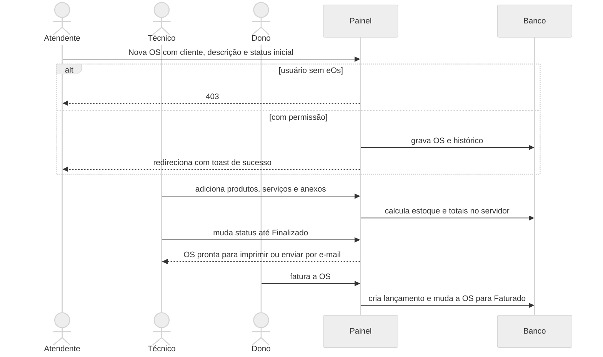
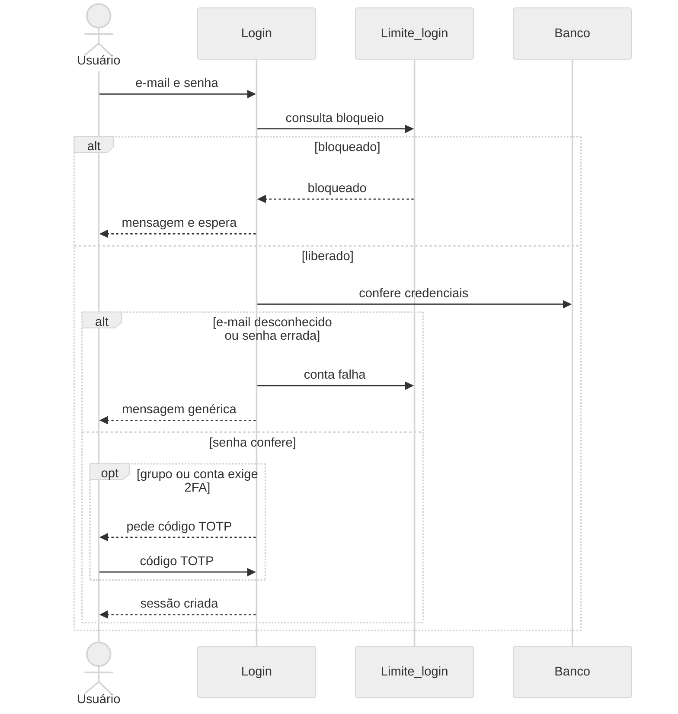
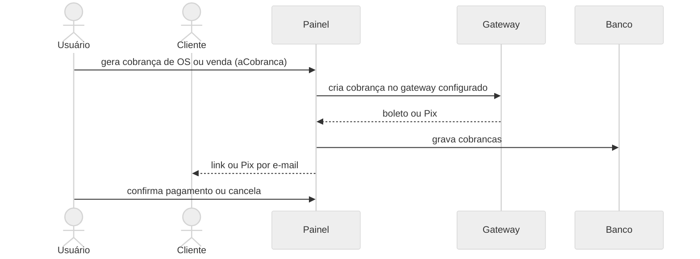

## Fluxos de Usuário

Sequência de interações para os principais fluxos da aplicação.

---

### Abertura e entrega de uma OS

```mermaid
%%{init: {'theme': 'neutral'} }%%
sequenceDiagram
  actor At as Atendente
  actor Tec as Técnico
  actor Dono as Dono
  participant P as Painel
  participant DB as Banco
  At->>P: Nova OS com cliente, descrição e status inicial
  alt usuário sem eOs
    P-->>At: 403
  else com permissão
    P->>DB: grava OS e histórico
    P-->>At: redireciona com toast de sucesso
  end
  Tec->>P: adiciona produtos, serviços e anexos
  P->>DB: calcula estoque e totais no servidor
  Tec->>P: muda status até Finalizado
  P-->>Tec: OS pronta para imprimir ou enviar por e-mail
  Dono->>P: fatura a OS
  P->>DB: cria lançamento e muda a OS para Faturado
```

### Login no painel

```mermaid
%%{init: {'theme': 'neutral'} }%%
sequenceDiagram
  actor U as Usuário
  participant L as Login
  participant LL as Limite_login
  participant DB as Banco
  U->>L: e-mail e senha
  L->>LL: consulta bloqueio
  alt bloqueado
    LL-->>L: bloqueado
    L-->>U: mensagem e espera
  else liberado
    L->>DB: confere credenciais
    alt e-mail desconhecido ou senha errada
      L->>LL: conta falha
      L-->>U: mensagem genérica
    else senha confere
      opt grupo ou conta exige 2FA
        L-->>U: pede código TOTP
        U->>L: código TOTP
      end
      L-->>U: sessão criada
    end
  end
```

### Cobrança por gateway

```mermaid
%%{init: {'theme': 'neutral'} }%%
sequenceDiagram
  actor U as Usuário
  actor C as Cliente
  participant P as Painel
  participant G as Gateway
  participant DB as Banco
  U->>P: gera cobrança de OS ou venda (aCobranca)
  P->>G: cria cobrança no gateway configurado
  G-->>P: boleto ou Pix
  P->>DB: grava cobrancas
  P-->>C: link ou Pix por e-mail
  U->>P: confirma pagamento ou cancela
```

---

_Criado em: 
