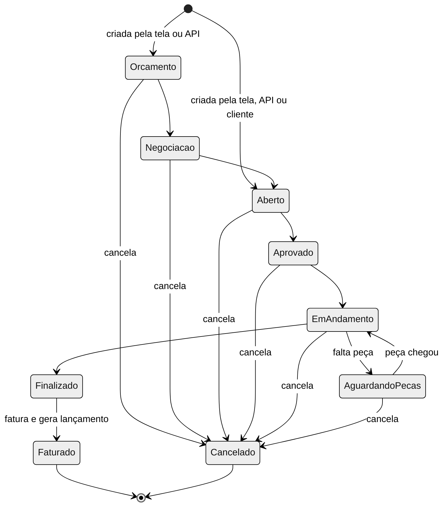
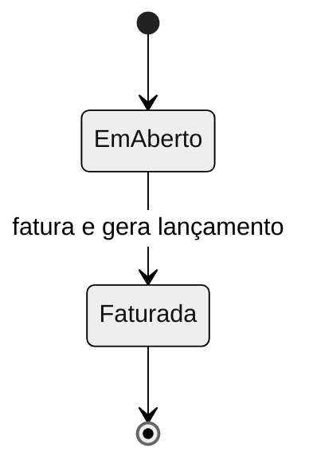
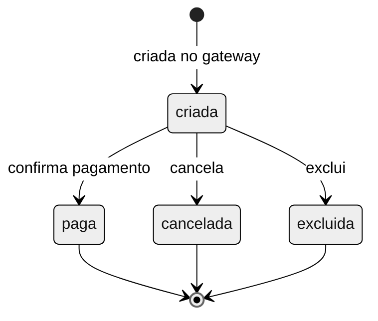

## Ciclo de Vida de Entidades

Transições válidas por entidade — base pro architect respeitar estados ao criar tasks.

---

### Ordem de serviço

```mermaid
%%{init: {'theme': 'neutral'} }%%
stateDiagram-v2
  [*] --> Orcamento: criada pela tela ou API
  [*] --> Aberto: criada pela tela, API ou cliente
  Orcamento --> Negociacao
  Negociacao --> Aberto
  Aberto --> Aprovado
  Aprovado --> EmAndamento
  EmAndamento --> AguardandoPecas: falta peça
  AguardandoPecas --> EmAndamento: peça chegou
  EmAndamento --> Finalizado
  Finalizado --> Faturado: fatura e gera lançamento
  Orcamento --> Cancelado: cancela
  Negociacao --> Cancelado: cancela
  Aberto --> Cancelado: cancela
  Aprovado --> Cancelado: cancela
  EmAndamento --> Cancelado: cancela
  AguardandoPecas --> Cancelado: cancela
  Faturado --> [*]
  Cancelado --> [*]
```

### Venda

```mermaid
%%{init: {'theme': 'neutral'} }%%
stateDiagram-v2
  [*] --> EmAberto
  EmAberto --> Faturada: fatura e gera lançamento
  Faturada --> [*]
```

### Cobrança

```mermaid
%%{init: {'theme': 'neutral'} }%%
stateDiagram-v2
  [*] --> criada: criada no gateway
  criada --> paga: confirma pagamento
  criada --> cancelada: cancela
  criada --> excluida: exclui
  paga --> [*]
  cancelada --> [*]
  excluida --> [*]
```

---

_Criado em: 
